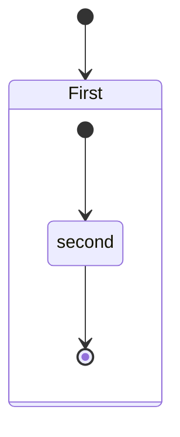

# **Tecnique Inform**

## School Management System

### Authors

* Laura Victoria Riera
* Marcos M. Tirador del Riego
* Leandro Rodriguez Llosa

## Data Dictionary

### 📋 **AdditionalService**

| Atributes                      | Name                    | Type    |
|--------------------------------|-------------------------|---------|
| Primary 🔑                     | Id                      | text    |
| Foreign 🔑 (to ***Worker***)   | WorkerId                | text    |
| Foreign 🔑 (to ***Resource***) | ResourceId              | text    |
|                                | WorkerPorcentageProfits | integer |

### 📋 **BasicMean**

| Atributes   | Name              | Type    |
|-------------|-------------------|---------|
| Primary 🔑  | Id                | text    |
|             | Price             | money   |
|             | Type              | text    |
|             | Origin            | text    |
|             | DevaluationInTime | integer |
|             | InaugurationDate  | text    |
|             | Description       | text    |

### 📋 **Classroom**

| Atributes   | Name     | Type    |
|-------------|----------|---------|
| Primary 🔑  | Id       | text    |
|             | Name     | text    |
|             | Capacity | integer |

### 📋 **Course**

| Atributes   | Name  | Type  |
|-------------|-------|-------|
| Primary 🔑  | Id    | text  |
|             | Name  | text  |
|             | Price | money |
|             | Type  | text  |

### 📋 **CourseGroup**

| Atributes                    | Name              | Type    |
|------------------------------|-------------------|---------|
| Primary 🔑                   | Id                | text    |
| Foreign 🔑 (to ***Course***) | CourseId          | text    |
| Foreign 🔑 (to ***Worker***) | CurrentTeacherId  | text    |
|                              | Capacity          | integer |
|                              | StartDate         | text    |
|                              | EndDate           | text    |

### 📋 **Expense**

| Atributes   | Name        |  Type  |
|-------------|-------------|--------|
| Primary 🔑  | Id          |  text  |
|             | Category    |  text  |
|             | Description |  money |

### 📋 **ExpenseRecord**

| Atributes                     | Name      | Type    |
|-------------------------------|-----------|---------|
| Primary 🔑                    | Id        | text    |
| Foreign 🔑 (to ***Expense***) | ExpenseId | text    |
|                               | Date      | text    |
|                               | Amount    | integer |
|                               | Value     | money   |

### 📋 **Position**

| Atributes   | Name | Type |
|-------------|------|------|
| Primary 🔑  | Id   | text |
|             | Name | text |

### 📋 **Resource**

| Atributes   | Name     | Type  |
|-------------|----------|-------|
| Primary 🔑  | Id       | text  |
|             | Name     | text  |
|             | Category | text  |
|             | Price    | money |

### 📋 **ResourceWorker**

| Atributes                      | Name                 | Type |
|--------------------------------|----------------------|------|
| Foreign 🔑 (to ***Worker***)   | ProviderId           | text |
| Foreign 🔑 (to ***Resource***) | ResourceItProvidesId | text |

### 📋 **Schedule**

| Atributes   | Name      | Type    |
|-------------|-----------|---------|
| Primary 🔑  | Id        | text    |
|             | Duration  | text    |
|             | StartDate | text    |
|             | DayOfWeek | integer |

### 📋 **SchoolMember**

| Atributes   | Name              | Type    |
|-------------|-------------------|---------|
| Primary 🔑  | Id                | text    |
|             | CardId            | text    |
|             | Name              | text    |
|             | LastName          | text    |
|             | PhoneNumber       | integer |
|             | Address           | text    |
|             | DateBecomedMember | text    |

### 📋 **Shift**

| Atributes                         | Name             | Type    |
|-----------------------------------|------------------|---------|
| Primary 🔑                        | Id               | text    |
| Foreign 🔑 (to ***Classroom***)   | ShiftClassroomId | text    |
| Foreign 🔑 (to ***Schedule***)    | ShiftScheduleId  | text    |
| Foreign 🔑 (to ***CourseGroup***) | CourseGroupId    | text    |

### 📋 **Student**

| Atributes                                      | Name                   | Type    |
|------------------------------------------------|------------------------|---------|
| Primary and foreign 🔑 (to ***SchoolMember***) | SchoolMemberForeignKey | text    |
| Foreign 🔑 (to ***Tuitor***)                   | TuitorId               | text    |
|                                                | Founds                 | text    |
|                                                | ScholarityLevel        | text    |

### 📋 **StudentGroupRelation**

| Atributes                         | Name                  | Type    |
|-----------------------------------|-----------------------|---------|
| Primary 🔑                                           | Id                    | text    |
| Primary 🔑 -----> Foreign 🔑 (to ***Student***)      | StudentForeignKey     | text    |
|             +----> Foreign 🔑 (to ***CourseGroup***) | CourseGroupForeignKey | text    |
|                                   | StartDate             | text    |
|                                   | EndDate               | text    |

### 📋 **StudentPaymentRecordForAdditionalService**

| Atributes                               | Name                        | Type    |
|-----------------------------------------|-----------------------------|---------|
| Primary 🔑                              | Id                          | text    |
| Foreign 🔑 (to ***Student***)           | StudentForeignKey           | text    |
| Foreign 🔑 (to ***AdditionalService***) | AdditionalServiceForeignKey | text    |
|                                         | Date                        | text    |

### 📋 **StudentPaymentRecordPerGroup**

| Atributes                         | Name                  | Type    |
|-----------------------------------|-----------------------|---------|
| Primary 🔑                        | Id                    | text    |
| Foreign 🔑 (to ***Student***)     | StudentForeignKey     | text    |
| Foreign 🔑 (to ***CourseGroup***) | CourseGroupForeignKey | text    |
|                                   | Date                  | text    |

### 📋 **WorkerCourseRelation**

| Atributes                    | Name                    | Type    |
|------------------------------|-------------------------|---------|
| Primary 🔑                   | Id                      | text    |
| Foreign 🔑 (to ***Worker***) | WorkerForeignKey        | text    |
| Foreign 🔑 (to ***Course***) | CourseForeignKey        | text    |
|                              | CorrespondingPorcentage | integer |

### 📋 **WorkerGroupRecord**

| Atributes                         | Name                  | Type |
|-----------------------------------|-----------------------|------|
| Primary 🔑                        | Id                    | text |
| Foreign 🔑 (to ***Worker***)      | WorkerForeignKey      | text |
| Foreign 🔑 (to ***CourseGroup***) | CourseGroupForeignKey | text |
|                                   | StartDate             | text |
|                                   | EndDate               | text |

### 📋 **WorkerPayRecordPerCourse**

| Atributes                    | Name             | Type    |
|------------------------------|------------------|---------|
| Primary 🔑                   | Id               | text    |
| Foreign 🔑 (to ***Worker***) | WorkerForeignKey | text    |
| Foreign 🔑 (to ***Course***) | CourseForeignKey | text    |
|                              | Date             | text    |
|                              | PaidPorcentage   | integer |

### 📋 **Tuitor**

| Atributes  | Name        | Type    |
|------------|-------------|---------|
| Primary 🔑 | Id          | text    |
|            | Name        | text    |
|            | PhoneNumber | integer |

### 📋 **Worker**

| Atributes                                      | Name                   | Type    |
|------------------------------------------------|------------------------|---------|
| Primary and foreign 🔑 (to ***SchoolMember***) | SchoolMemberForeignKey | text    |

## App Layout Outline

jfladsjlfksd

## Class Schema Defined

sdklfjlkasjdf

## Others

